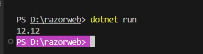
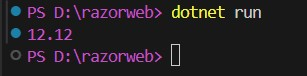
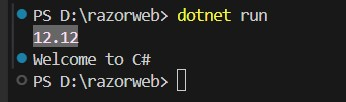
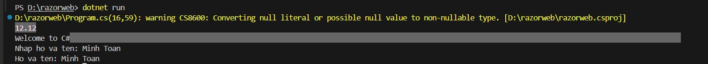
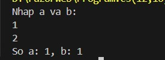

# CS02 Variables, constants, data types and terminal console input/output ☠🐱‍🏍🐱‍👤

### Float data type 🦠

```
float c;
c = (float)12.12;

// or must be 12.12f
```

### Set background color for console 🦠

```
Console.BackgroundColor = ConsoleColor.DarkMagenta;
```



### Set text color for console 🦠

```
Console.ForegroundColor = ConsoleColor.DarkMagenta;
Console.Title = "Vi du su dung Console";
Console.WriteLine(c);
```



### Reset color 🦠

```
Console.ForegroundColor = ConsoleColor.DarkMagenta;
Console.BackgroundColor = ConsoleColor.DarkGray;
Console.Title = "Vi du su dung Console";
Console.WriteLine(c);
Console.ResetColor();
Console.WriteLine("Welcome to C#");

```



### Data entry 🐟
```
Console.Write("Nhap ho va ten: "); string hovaten = Console.ReadLine();
Console.WriteLine("Ho va ten: {0}", hovaten);
```


### Convert string to another data type 👻
```
float a,b;
string sinput;
Console.WriteLine("Nhap a va b: ");
sinput = Console.ReadLine();
a = float.Parse(sinput);
sinput = Console.ReadLine();
b = Convert.ToSingle(sinput);
Console.WriteLine("So a: {0}, b: {0}", a,b);
```

