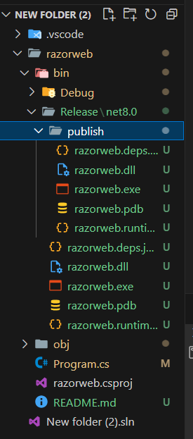

# Introducing and initial Razor page 🎍🎪🎢🎭🧶

## Using TagHelper

```cs
@page
@* If we access /Dichvu without name after, the Dichvu route will find the index for default *@
@addTagHelper *, Microsoft.AspNetCore.Mvc.TagHelpers
<h1>Trang dich vu mac dinh</h1>
<a asp-page="Dichvu1">Dich vu 1</a> <br />
<a asp-page="Dichvu2">Dich vu 2</a>
```

## Program.cs

Some notes about initial Urls.

```cs
service.AddRazorPages().AddRazorPagesOptions(option =>
{
    // Change Razor site storage directory
    option.RootDirectory = "/Pages";
    // Change site address to anohter name
    option.Conventions.AddPageRoute("/FirstPage", "trangdau.html");
});
service.Configure<RouteOptions>(route =>
{
    route.LowercaseUrls = true;
});
```

## Using functions

```cs
@page
@* If we access /Dichvu without name after, the Dichvu route will find the index for default *@
@addTagHelper *, Microsoft.AspNetCore.Mvc.TagHelpers
<h1>@this.title</h1>
<a asp-page="Dichvu1">Dich vu 1</a> <br />
<a asp-page="Dichvu2">Dich vu 2</a>
<br />
<a asp-page="/Sanphammoi" asp-area="Product">Cac san pham moi</a>
@functions{
  string title {set;get;} = "Day la trang mtoan dau tien";
}
```

## Using ViewData

```cs
@{
  ViewData["data"] = "Đây là trang razor page đầu tiên";
}
<h1>@ViewData["data"]</h1>
```

## Using Handler

```cs
@functions{
  /*
    OnGet, OnPost() -> These things call Handler
  */

  // Access by GET method
  public void OnGet(){
    ViewData["second"]="Đã call OnGet";
  }
}
<h1 style="color: red;">@ViewData["second"]</h1>
```

## Page model

SecondPage.cshtml

```cs
@page
<h1 style="color: blue;">Đây là trang thứ 2</h1>
<h1>@ViewData["data2"]</h1>
```

**SecondPage.cs**

```cs
using Microsoft.AspNetCore.Mvc.RazorPages;

public class SecondPage : PageModel{
  public void OnGet(){
    ViewData["data2"] = "Đã call đến PageModel";
  }
}
```

## Using Layout

**\_MyLayout.cshtml**

```html
<!DOCTYPE html>
<html lang="en">
  <head>
    <meta charset="UTF-8" />
    <meta name="viewport" content="width=device-width, initial-scale=1.0" />
    <title>Document</title>
  </head>
  <body>
    <div style="background: blue;">Phan Header</div>
    @RenderBody()
    <div style="background: green;">Phan Footer</div>
  </body>
</html>
```

**SecondPage.cshtml**

```cs
@page
@model SecondPage
@{
  Layout="_MyLayout";
}
<h1 style="color: blue;">Đây là trang thứ 2</h1>
<h1 style="color: cadetblue;">@ViewData["data2"]</h1>
```

## Using \_ViewStart.cshtml

**\_ViewStart.cshtml** will apply Layout for all 3 elements: **FirstPage**, **SecondPage** and **ThirdPage**.



**\_ViewStart.cshtml**

```cs
@{
  Layout="_MyLayout";
}
```

## Using \_ViewImport.cshtml

**\_ViewImport.cshtml** is just used for **TagHelper** and **using** for loading namespace.

**\_ViewImport.cshtml**

```cs
@addTagHelper *, Microsoft.AspNetCore.Mvc.TagHelpers
```
